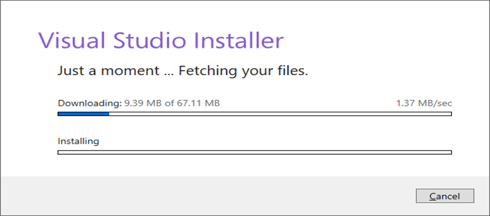

Setup Development Environment

#Tasks:

1. Select Your Operating System (OS):
How to download and install Windows 11: Step 0: Make sure you're ready 

Before you take the plunge of installing Windows 11, you should make sure your PC is ready and that all your data is secure. 

Step 1: Check your PC/Laptop for compatibility, you can use APPS or websites to check if your system is compatible with Windows 11. If your system meets the requirements and is compatible, then back up your data. 
Step 2: Download the ISO File on Windows 11 Download (Follow the steps to download the ISO file). Use a clean USB with at least 8gig and save the ISO in the USB.

Step 3: Once downloaded and you get a notification that the file transfer is complete, use the Eject function on your USB utility to prepare the removal before you pull it off the computer.

Step 4: With the Windows 11 installation file on the thumb drive and formatted the USB to be a bootable drive using the Media Creation Tool, you can now move on to the installation stage. 

Step 5: Installation Steps are as follows 
		Plug the USB drive into the computer and restart the computer.
        Before the computer fully turns back on, hold the F8 key. The exact command will depend on your computer. Note: You must do this before the Windows or manufacturer's brand logo appears on your screen. If you see the logo, you waited too long and must restart again.
        When prompted, choose the boot order and select the USB drive option as first. You’ll then be told to press any key to continue booting from your specified location.
        Your computer should start up as normal but with Windows 11 prepared to install and run at the start-up screen.
Step 6: Now that your PC is running on Windows 11, you need to set up your account and preferences for each time you log on. Many of these preferences are similar to Windows 10, but there are some differences.
To start using Windows 11, choose the language you want for installation, your time zone, currency format, and how you want to input data (for most people, this is the keyboard). There are some present definitions to set, but you may not need to tinker with these additional settings.
With everything specified, click the Install Now button.

Step 7: Windows 11 is free for those who already own Windows 10 and are eligible for an upgrade. If this is you, then your Windows 10 product key should work for Windows 11, if not you can run a trial version of Windows 11 with limited features. Just pick I don’t have a product key during installation to start using it in the meantime. If you get a product key at a later point, you can always enter it. 

Step 8: You will receive a prompt to pick your version of Windows 11 before the installation completes. If you were eligible for a free upgrade, this should match the version you had for Windows 10. 

Step 9: Read the terms and conditions and licensing agreement before accepting them. Then choose the upgrade option if you want to keep your files and applications or r (if doing a clean install), select the custom option, which puts Windows on your system.

Step 10: Select the location for your Windows. Pick the partition designed for your operating system and click Next. It will take some time to finish the installation process. Your computer will also reboot at least once. When it’s done, the new login screen will appear.	

2. Install a Text Editor or Integrated Development Environment (IDE):
   2.	Installation of Text Editor (Visual Studio) 

    Step 1. Download Visual Studio

    First, visit the following Visual Studio free download link (https://visualstudio.microsoft.com/downloads/)
    

    Step2. Select a version of your choice: 
        Visual Studio 2019 Community Edition
        Visual Studio 2019 Professional Edition (30 Day Free Trial)

    Step 3.Click on the downloaded exe file  
    

    Step 4: In the next screen click continue to start Visual Studio installation 
    

    Step 5: Visual Studio will start downloading the initial files. Download speed will vary as per your internet connection. 
    

    Step 6: Choose software version then in the next screen, click install 
    

    Step 7: Select the desktop version. In the next screen;
    1.	Select .Net desktop environment
    2.	Click install
    

     8: Wait for the files to be downloaded, Visual Studio will download the relevant files based on your selection for step in Step 7. 
    

    Step 8: Reboot your PC once download is done. 
    

    Step 10: Post reboot, open visual studio IDE. Select a theme of your choice and click start Visual Studio.
    

Reference: https://www.guru99.com/download-install-visual-studio.html - 

3. Set Up Version Control System:

Step 1: Download the Git Bash setup from the official website https://git-scm.com/

Step 2: Download the installer

Step 3: Run the .exe file you just downloaded and follow the instructions in the installer.
    

Step 4: Select the components that you need to install and click on the Next button.
    

Step 5: Select the path where you want to install git as shown in the image below.
    

Step 6: Let the installation process finish to begin using Git Bash.
    

Step 7: Once installation is done. Open Gitbash, right click and open as administrator. 
    

How to use connect Gitbash to Github.
Step 1: Configure git by using this command 
Set your username:
        git config --global user.name "FIRST_NAME LAST_NAME"

Set your email address:
        git config --global user.email MY_NAME@example.com

Step 3: Change your current working directory to a folder where you would like to store your project. You the command cd.

Step 4: Commit Repository in Git Bash
Initialize the local directory as a Git repository.
        git init 
Stage the files for the first commit by adding them to the local repository
        git add .
 By “git status“ you can see the staged files after that Commit the files that you’ve staged in your local repository.
        git commit -m "First commit"
Now After the “git status” command, it can be seen that nothing to commit is left, Hence all files have been committed.

Step 5: Step 3: Initializing a Local Git Repository

Open GitHub through the internet and click on create new repository Give a suitable name for your repository and create the repository.

Note:  You can choose to initialize your git repository with a README file, and further, you can mention your project details in it. It helps people know what this repository is about. However, it’s absolutely not necessary.

The following will appear after creating the repository

Step 4: Connect the local Repository to GitHub
Go to the GitHub repository and in the code, section copy the URL and In the Command prompt, add the URL for your repository where your local repository will be pushed.
    git remote add origin repository_URL
Push the changes in your local repository to GitHub.
        git push origin master
Here the files have been pushed to the master branch of your repository. Now in the GitHub repository, the pushed files can be seen.

    Step 5: Pulling and Pushing Changes to GitBash
    Suppose the files are being changed and new files are added to the local repository. To save the changes in the git repository:
    Download all the other changes from the remote repository to the local repository.
        git pull 
    Changes have to be staged for the commit.
        git add .
    or
        git add file_name
    Now commit the staged files.
        git commit -m "commit_name"
    Push the changes.
        git push origin master

Reference: https://www.geeksforgeeks.org/working-on-git-bash/

4. Install Necessary Programming Languages and Runtimes:
  
  How to install python:
    Step 1: Select Version to Install Python. Download on [Python Download](https://www.python.org/downloads/). on the Windows operating system. Locate a reliable version of Python 3.

    Step 2: Downloading the Python Installer
    Once you have downloaded the installer, open the .exe file, such as python-3.12.4-amd64.exe, by double-clicking it to launch the Python installer. Choose the option to Install the launcher for all users by checking the corresponding checkbox, so that all users of the computer can access the Python launcher application. Enable users to run Python from the command line by checking the Add python.exe to PATH checkbox.
    

    Step 3: After Clicking the Install Now Button the setup will start installing Python on your Windows system. You will see a window like this.

    Step 4: After completing the setup. Python will be installed on your Windows system. You will see a successful message.

    Step 5:  Verify the Python Installation in Windows
    Close the window after successful installation of Python. You can check if the installation of Python was successful by using either the command line or Powershell.
    To access the command line, click on the Start menu and type “cmd” in the search bar. Then click on Command Prompt.
        
        python –version

Once you see it’s the version. Download and path is successful

5. Install Package Managers:
   Installing PIP
    Step 1: Open command prompt or Powershell. 
    Step 2; Check if python is installed by using command :
	    python –version.
    If it installed, you will see something like this;
        Python 3.10.11.
    Step 3: Check if PIP is installed by opening the CMD and typing the command: pip then enter, if pip is not installed you will get an error message: 

How to install PIP.
    Step 4: Install PIP on Windows
    Step 5: Now that we downloaded the get-pip.py file, we need to complete the followings steps.
        Open the command line
        Navigate to the folder where Python and the get-pip.py file are stored using the cd command
        Launch the installer by running the following command:
            python get-pip.py

    Step 6:After a quick installation process, a message appears with all the details of the installation, and the final line appears as follows:
        Successfully installed pip-22.0.1 wheel-0.37.1
        PIP is now successfully installed on Windows.

    Step 7:Verify the PIP Installation Process and Check the PIP Version
    To double-check if PIP has been installed properly and check its version, we need to run one of these commands in the command line:
        pip --version
    or
        pip -V
    Step 8: If PIP is installed correctly, we will see a message indicating the version of PIP and its location on the local system, like the following:

        pip 22.0.2 from C:\Users\Utente\AppData\Local\Programs\Python\Python310\lib\site-packages\pip (python 3.10).
    If instead, an error is thrown, it is necessary to repeat the installation process.

Reference : https://www.dataquest.io/blog/install-pip-windows/

6. Configure a Database (MySQL):
   Step 1: Download MYSQL Installer for Windows from [MYSQL Download.](https://dev.mysql.com/downloads/installer/)
    Step 2: Select my mysql-installer-web-community if you have a good internet connection otherwise choose mysql-installer-community

    Step 3: On the next page, you’ll be prompted to log in or create a MySQL account. You can choose “No thanks, just start my download.”

    Step 4: After downloading, unzip it and double click the MSI installer .exe file.

    Step 5: Suppose you’re using MySQL as a developer, select Developer Default. Then Click “Next”

    Step 6: Step 4: Once you download everything you selected, you’ll reach a setup screen. You can leave most settings on default (but be sure to choose Dedicated Computer if you’re setting up a database server on this machine).

    Step 7: See what products that will be installed. Click "Execute" to download and install the Products. After finishing the installation, click "Next".

    Step 8: You’ll also have to set a root password and optionally add extra users.
    And if you want MySQL to run at start-up, be sure to tick the relevant box.

    Step 9: With the configuration finished, you’ll complete the installation. If you’re ready to try out MySQL, leave Start MySQL Workbench after the Setup checked. You can always launch MySQL Workbench later by clicking the start menu and typing it into the search bar.

    Step 10: After completing all of the above steps and procedures, you can finally check if MySQL has been installed or not

8. Explore Extensions and Plugins:

    Step 1: How to enable extension on Visual Studio:
    Step 2: Open Visual Studio
    Step 3: On the the left side of the IDE, click on extensions , it’s an icon with 4 square boxes
    Step 4: On the search bar, search for the extension you require eg.python 
    Step 5: Then click install and the extension will be installed. 
        Extensions I have installed are:
        1.	Code Runner
        2.	Dart
        3.	Flutter
        4.	Pylance
        5.	Python 
Github sample link.: https://github.com/Bontzz/Sample_rep.git

Challenges faced.

I faced a challenge in MYSQL. At first it didn’t want to connect to the serve, I reinstalled it 3 times but eventually I managed to add a PATH and it worked. Other environments were quiet easy to install and incorporate on my system.  

